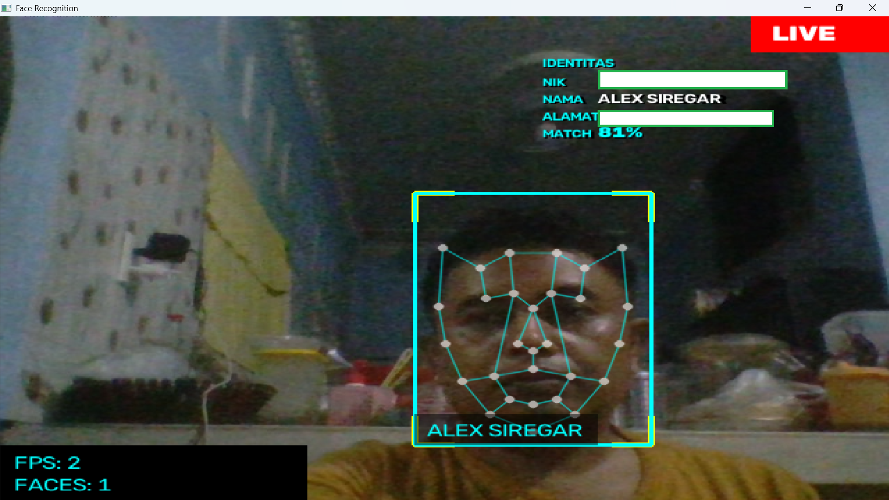

# Face Recognition

Face recognition with a jarvis-style dot overlay. OpenCV (**YuNet**) finds faces,
onsnxruntime runs **AdaFace** (ONNX, MIT license) for 512-d face embeddings.
No dlib, no cmake.

## Setup

```
pip install -r requirements.txt
python setup_models.py      # downloads YuNet + AdaFace ONNX models once
```

`opencv-contrib-python` handles detection; `onnxruntime` runs the **AdaFace IR-101**
embedding model (MIT-licensed, free to use commercially). The model files are
downloaded automatically: YuNet from the OpenCV model zoo and AdaFace from the
[adaface-onnx release](https://github.com/yakhyo/adaface-onnx).

## Upgrading from the old SFace embeddings

Data registered with the previous SFace-based embedding is **not compatible**.
`verify.py` refuses mismatched registrations with a "re-register" hint — delete
`data/` and register everyone again once.

## Register a person

```
python register_face.py John john.jpg
```

Use a clear front-facing photo. Register the same person multiple times with
different photos (angles/lighting) — each call re-embeds all of that person's
photos and stores the mean embedding, improving accuracy.

## Run

```
python main.py                                   # webcam
python main.py --source photo.jpg --output result.jpg
python main.py --source video.mp4 --output result.mp4
```

Known face = cyan box + jarvis dots + name tag. The borderless identity text
(NIK / NAME / ADDRESS / MATCH) appears at the top-right for people listed in the
roster, with the NIK masked (`12xx-xxxx-0003`). Unknown = red box.
Press `q` to quit (webcam/video mode).

## 2021 KTP Photo – Sample Test

A 2021 KTP (Indonesian ID card) photo used as a sample test image. The recognition
pipeline registers the holder's face under the NIK and displays a cyan box + name
tag + identity text (NIK / NAME / ADDRESS / MATCH) in the live view.



## Register from an Indonesian ID card (KTP)

```
python ktp_register.py 3273011501900001 ktp_scan.jpg
```

Pipeline: detects the card corners, warps it flat (perspective correction),
extracts the card holder's face, and registers it under the holder's **NIK**
(validated as exactly 16 digits). Face selection picks the largest face and
biases toward the holder's photo (right half of a dewarped card, vertically
centered); if no face is found registration fails with a clear message. When the
card corners are not detected the photo is used as-is (a flat scan still works).

### Auto-read NIK / name with OCR (optional)

If Tesseract is installed, `--ocr` reads the NIK (and best-effort name) straight
from the KTP photo so you don't have to type it:

```
python ktp_register.py --ocr ktp_scan.jpg
```

`python ktp_ocr.py ktp_scan.jpg` prints the raw extracted fields for inspection.
Tesseract is detected automatically on Windows/Linux; override with
`--tesseract-cmd` / `--tessdata-dir`. Indonesian (`ind`) is used when the
traineddata file is available, otherwise English. NIK digits are re-OCR'd with a
digits-only whitelist for reliability — the 16-digit NIK is the critical field.

Instead of a scan, capture fresh samples from the webcam (recording a person who
is already present):
`python ktp_register.py <NIK> --capture 10 [--name "NAME"]`.

## Batch register from Excel (master CSV)

Keep the roster in an Excel sheet, export it as a **semicolon-separated CSV**, and
register every KTP photo in one pass. The columns used are `filename` (photo file
name), `nik` (16 digits) and `nama`; extra columns such as `alamat` are passed
through and shown in the camera overlay's identity text.

```
python batch_register_ktp.py                     # defaults: data/master_ktp.csv + ktps/ + reports in data/
python batch_register_ktp.py --csv team.csv --ktps scans/ --report report.csv
```

Put the KTP scans in the `ktps/` folder, named exactly as the `filename` column.
Rows already imported are skipped (progress tracked in `data/batch_state.csv`);
pass `--force` to re-register them anyway. A per-row report (`data/batch_report.csv`)
and a console summary tell you how many succeeded. At startup the camera reads
`nama`/`alamat` from this CSV, so the overlay shows NIK / NAME / ADDRESS / MATCH
for people listed in the roster (a local, git-ignored `data/personal_info.csv` is
merged on top for real people — see "Privacy").

## Verify live against a registered NIK (1:1)

```
python verify.py 3273011501900001                 # webcam
python verify.py 3273011501900001 --source cam.mp4
python verify.py 3273011501900001 --source photo.jpg   # static image, liveness will fail
```

The identity must keep matching the registered NIK for ~3 s **while a blink is
detected** (eye-area brightness impulse while the face is steady), so a printed
photo of a KTP cannot pass. For cameras with poor eyelid detail, `--motion-only`
falls back to nose-tracking movement instead. Natural blinks don't break the
streak — brief interruptions only decay it, while a clearly different person
hard-resets it. Tune strictness with `--threshold` (default 0.45). Options:
`--no-show` for headless runs, press `q` to quit.

## Reuse for a new client

1. Copy this whole folder.
2. Delete everything inside `data/`.
3. Register the new client's people.
4. Done - same code, new data.

### Keeping real people out of the repo (real persons / PDP)

The committed `data/` and `ktps/` contain only **synthetic example** KTPs (sample
faces reuse public test photos). To register a real person **locally-only** so
their face/NIK never lands in a commit:

```
git update-index --assume-unchanged data/embeddings.json
python ktp_register.py 3273011501900001 path/to/ktp.jpg        # or --ocr
```

For the best live-camera accuracy, also add current-face samples straight from
the webcam (the KTP photo is often years old; templates that include *live*
frames match the camera far better):

```
python ktp_register.py 3273011501900001 --capture 10 --name "A Real Person"
```

Each additional sample re-embeds and averages with the previous ones. Reset the
tracked file later with
`git update-index --no-assume-unchanged data/embeddings.json`.

## Privacy (PDP / GDPR)

NIK and face templates are **personal data**. The committed `data/` and `ktps/`
contain only the synthetic example people; real-person registrations stay local
(faces dir is `.gitignore`d, `embeddings.json` marked assume-unchanged) and
nothing ever leaves your machine. When publishing, audits, or sharing screenshots,
mask NIKs (the repo masks them in its own display). Delete `data/` before handing
the repo out to a new client.

## Notes

- `COSINE_THRESHOLD` in main.py (0.45) = strictness. Similarity is a cosine
  score (~1 for the same person, below 0 for different people) — higher
  threshold = stricter match. Pass `--threshold 0.7`
  on the CLI (main.py and verify.py) instead of editing code.
- Accuracy improves a lot with 3-5 photos per person vs just 1.
- YuNet + AdaFace handle odd angles and low light far better than a Haar/LBPH
  pipeline, and need only a few hundred MB of ONNX models downloaded once.
  `setup_models.py` ships **AdaFace IR-101** (~260 MB). The faster IR-18
  variant is **not** a drop-in swap: you must point `setup_models.py` at it,
  update `EMBEDDING_MODEL` in `core/embedder.py`, and re-register everyone —
  `embedding_compatible` rejects embeddings whose model tag differs.
- Multi-sample registrations store the L2-normalized mean embedding, so adding
  more photos never biases the similarity score.
- Blink liveness is a heuristic (eye-area brightness impulse while the face is
  steady); on hardware where YuNet can't track the eyes it may need
  `--motion-only`. Liveness checks defend against still photos, not 3D masks.

## Tests

```
pip install -r requirements.txt pytest
# apt/dnf/winget install tesseract-ocr   # optional — OCR tests skip if missing
python -m pytest
```

The suite covers detector/embedder math, KTP dewarp + face extraction, register-
and-verify flows (blink liveness, motion-only, impostor rejection), and OCR NIK
parsing. CI runs it on Ubuntu via `.github/workflows/ci.yml`.