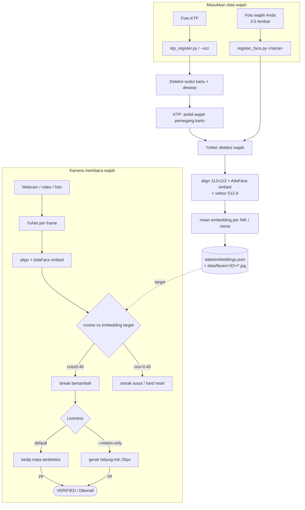

# Alur penggunaan: memasukkan data wajah agar kamera mengenali Anda

## 1. Persiapan (sekali)

```
pip install -r requirements.txt
python setup_models.py          # unduh YuNet + AdaFace ke models/
```

## 2. Daftarkan wajah Anda

**Opsi A — dari KTP (verifikasi 1:1 berbasis NIK + liveness blink):**

```
python ktp_register.py 3273011501900001 foto_ktp.jpg     # NIK diketik manual
python ktp_register.py --ocr foto_ktp.jpg                 # NIK + nama dibaca otomatis
```

**Opsi B — dari foto wajah biasa (identifikasi 1:N):**

```
python register_face.py Budi budi1.jpg
python register_face.py Budi budi2.jpg      # 3–5 foto beda sudut/cahaya = makin akurat
```

Setiap panggilan menghitung ulang *mean embedding* untuk nama/NIK itu.

## 3. Jalankan kamera

```
python verify.py 3273011501900001 --source 0     # webcam; wajah + kedip ±3 detik → VERIFIED OK
python main.py    --source 0                      # identifikasi nama di frame (tanpa liveness)
```

`--source 0` = webcam. `verify.py` menolak foto statis (butuh blink/motion); jika blink
sering gagal di hardware Anda: `python verify.py <NIK> --source 0 --motion-only`.

## Diagram alur



Versi ASCII ringkas:

```
  DAFTAR FOTO Anda:
    ktp_register.py (+--ocr) ──► dewarp ──► ambil wajah ──┐
    register_face.py <nama>   ────────────────────────────┴► YuNet ──► align ──► AdaFace embed(512d)
                                                                          │
                                                                          ▼
                                                        mean embedding ──► data/embeddings.json
                                                                          ▲
  CAM membaca:                                   frame cam ──► YuNet ──► embed ──► cosine vs target
                                                                          └── cocok? streak ─► + liveness (blink/motion) ─► VERIFIED / Dikenali
```

Data wajah tersimpan lokal di `data/` (gitignored); tidak ada yang keluar mesin.

## Registrasi massal KTP dari Excel (CSV)

Cocok untuk skala banyak orang (mis. ratusan KTP) tanpa mengetik NIK satu per satu:

1. **Isi `data/master_ktp.csv`** (buka dengan Excel; pemisah `;`, tanda kutip `"`): satu baris per foto KTP.
   Kolom: `filename;nik;nama;tempat_lahir;tanggal_lahir;jenis_kelamin;alamat`. NIK harus 16 digit.
   Satu orang boleh punya banyak baris (foto berbeda) — NIK sama = mean embedding gabungan.
2. **Letakkan foto** di folder `ktps/` dengan nama sesuai kolom `filename` (contoh: `ktp_alex.jpg`).
3. **Jalankan batch**:
   ```
   python batch_register_ktp.py
   ```
   Output: `data/batch_report.csv` (`filename;nik;status;pesan`) + ringkasan di terminal.
   Idempoten — file yang sudah ter-registrasi dicatat di `data/batch_state.csv` dan dilewati pada run berikutnya
   (pakai `--force` untuk ulangi). Untuk menambah baris/foto baru, cukup isi CSV lalu jalankan lagi.

Pembuatan file contoh (opsional, data fiktif untuk uji coba):
```
python tools/gen_ktp_samples.py      # generate 9 KTP sintetik -> ktps/ sesuai baris 'contoh' di CSV
```

Catatan batch:
- Kalau foto kartu tidak bisa di-dewarp (misal SIM/foto potret dengan kartu miring), wajah tetap dipilih
  serta register — algoritma memilih wajah terbesar bila kartu tak terdeteksi.
- NIK yang gagal dibaca OCR bisa langsung diketik di kolom CSV tanpa perlu memproses ulang seluruh batch.
- Data tetap 100% lokal: NIK + embedding hanya tersimpan di `data/` (gitignored); mask di layar.

> **Catatan:** data yang didaftarkan dengan SFace (versi lama) tidak kompatibel — hapus
> `data/` lalu daftarkan ulang sekali.